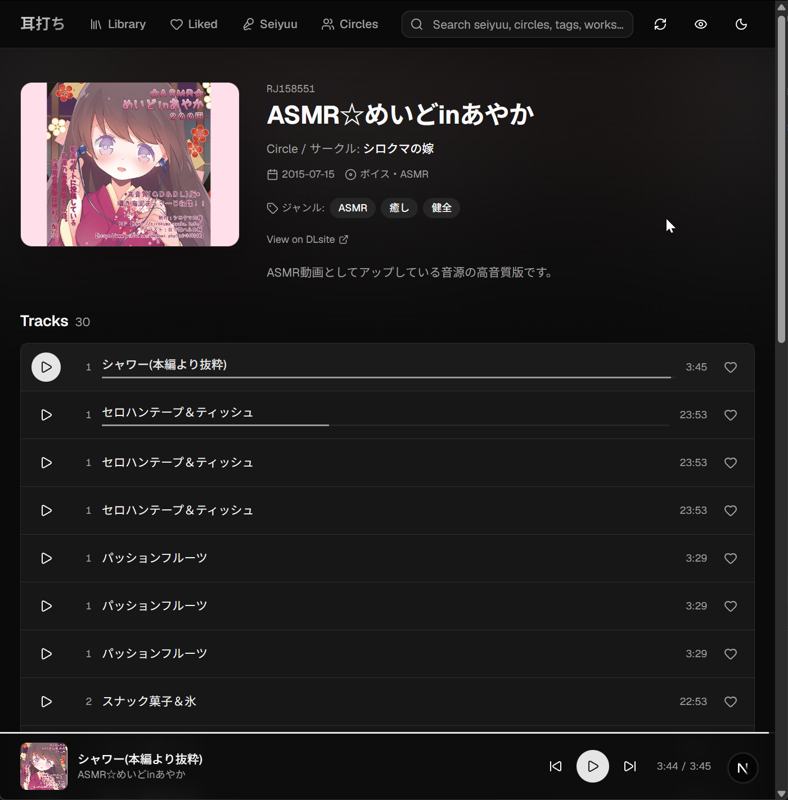
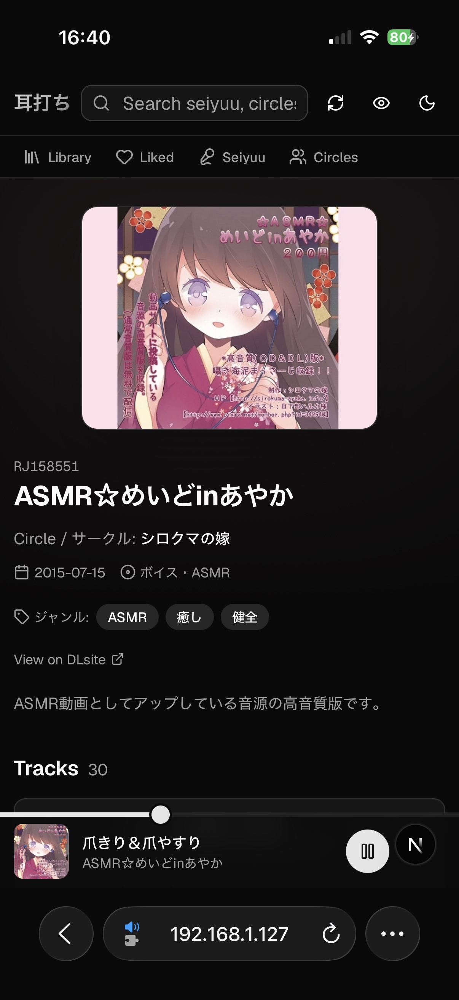

# mimiuchi

A personal audio library web app for browsing and playing locally-stored audio works. Point it at a folder of RJ-coded releases and it builds a searchable, taggable library with covers, metadata, and a player that follows you around the app.

<p align="center">
  
  
</p>

## Features

**Library**

- Scans one or more local folders of RJ-coded works and pulls titles, cover art, circle, voice actors, and tags automatically
- Works still packed in a `.zip`, `.rar`, or `.7z` are listed too, with their full metadata and a red tint to mark that there is nothing to play yet — extract the archive and re-scan and the entry becomes the real thing, no duplicate left behind
- Browse by work, by voice actor, or by circle
- Filter by tag, voice actor, and circle, with sorting
- Fuzzy Japanese search with autocomplete — type romaji, kana, or kanji and it finds the match
- Edit a work's cover, voice actors, and metadata by hand; add your own tags; delete an entry
- Reveal a work's folder in your file manager
- Blur R18 covers with one click, and a light/dark theme toggle

**Extras**

- Picks up the non-audio files that ship with a work — bonus illustrations, おまけ videos, and 台本 (scripts) — and puts them in a collapsed panel on the work page, so they never crowd out the tracks
- Scripts are told apart from readmes, which are always ignored; a 台本 is recognised even when only the folder it sits in says so
- Reads a `.txt` 台本 in the app as continuous vertical Japanese, with a horizontal toggle and adjustable text size. PDF scripts open in a new tab
- When a work ships one 台本 per track, each track row gets its own link to it
- Illustrations open in a gallery; videos play in place, seekable however large they are

**Playback**

- Persistent player bar that keeps playing as you navigate
- Queue, plus media-session support so lock-screen and headset controls work
- Remembers your position in every track and picks up where you left off
- Choose between a classic progress bar or a waveform seek bar that shows loudness so you can see pauses and peaks before scrubbing (generated once per track and cached)
- Per-track bookmarks, stored server-side so they follow you between devices
- Like tracks and browse everything you've liked in one view
- "On deck" row of recently added works, with a shuffle for when you can't decide

**Setup & admin**

- Trigger a library scan from inside the app with live progress, including an
  extras-only pass that re-reads files without contacting DLsite
- Single shared password login
- Configure library roots, cover directory, and an optional outbound proxy from the settings page

## Prerequisites

- Node.js 20+
- [pnpm](https://pnpm.io/installation)
- A directory of audio works named by DLsite RJ code (e.g. `RJ01000380/...`), or archives named the same way (e.g. `【RJ01000380】【MP3】.zip`)
- `ffmpeg` on your `PATH` — optional, only needed for the waveform seek bar (or point `KIKOERU_FFMPEG_PATH` at the binary)

## Setup

```bash
git clone https://github.com/4890A/mimiuchi.git
cd mimiuchi/web
pnpm install
cp .env.example .env.local
```

Edit `web/.env.local` and set the variables below.

### Environment variables

| Variable | Required | Description |
| --- | --- | --- |
| `KIKOERU_LIBRARY_ROOT` | yes | Absolute path to the folder containing your RJ-coded work directories |
| `KIKOERU_PASSWORD` | yes | Shared password used to log in (any non-empty string) |
| `KIKOERU_SESSION_SECRET` | no | Overrides the session-cookie signing key. If unset, a random 32-byte secret is generated on first run and stored in `<KIKOERU_DATA_DIR>/session-secret` |
| `KIKOERU_DATA_DIR` | no | Where the SQLite database lives (defaults to `../data` relative to `web/`) |
| `KIKOERU_COVERS_DIR` | no | Where cover art is cached (defaults to `<project-root>/covers`) |
| `KIKOERU_FFMPEG_PATH` | no | Path to the `ffmpeg` binary if it isn't on your `PATH` |
| `KIKOERU_THUMBNAIL_CACHE_MB` | no | Ceiling for the gallery thumbnail cache in `<KIKOERU_DATA_DIR>/thumbnails` (default 512, `0` for no limit) |

## Running

All commands run from the `web/` directory.

### Normal use

Build once, then start the server. This is the mode to use day to day: an
optimized build, without the dev server's hot reloading, source maps, and
verbose console output.

```bash
pnpm build          # compile the app
pnpm start          # serve it on http://localhost:3000
```

The server runs in the foreground until you stop it with `Ctrl-C`. It serves
whatever `pnpm build` last produced, so re-run `pnpm build` after pulling or
editing code — a running server won't pick the changes up on its own.

To use a different port, pass `-p` (or set `PORT`):

```bash
pnpm start -p 3001
```

`pnpm start` listens on `0.0.0.0`, so the app is reachable from phones and
other machines on your network at `http://<your-machine-ip>:3000` without any
extra configuration. Nothing here starts on boot by itself — wrap `pnpm start`
in whatever your OS uses to keep services alive (a systemd unit, a Windows
scheduled task, pm2) if you want it always available.

### Development

```bash
pnpm dev            # dev server with hot reloading, on http://localhost:3000
```

Use this only while working on the code — it recompiles on every change and
logs far more, which makes it noticeably slower to browse.

> Hitting the **dev** server from another device also needs that device's IP in
> `allowedDevOrigins` in `web/next.config.ts`. Without it Next.js blocks the
> page's JavaScript from taking over, and the app renders but every button is
> dead. `pnpm start` has no such restriction.

The database is created and migrated automatically on first connection — a
fresh checkout provisions an empty database on startup, so there's no manual
migration step. (Existing databases from before automatic migrations are
detected and left untouched.)

On first visit, log in with `KIKOERU_PASSWORD`. Then trigger a library scan from the in-app **Scan** button — it walks your library root, fetches metadata, and streams progress to a panel in the bottom-right. Re-run whenever you add new works.

> Upgrading from a version without the extras panel? Just scan once. The first
> scan after the upgrade re-walks every work to index its non-audio files, then
> goes back to skipping unchanged ones. It reads local directories only — no
> metadata is fetched — so it costs seconds and nothing else.

Later on, if you drop new files into a work you have already scanned, use
**Re-scan extras only** in Settings. An ordinary scan skips a work whose folder
hasn't changed, and that check looks at the work folder itself — which adding
`おまけ/台本.txt` does not touch, since only the immediate parent directory's
timestamp changes. The extras scan re-reads every work's files and never
contacts DLsite, so it is the cheap way to pick those up; a full force rescan
would find them too, but only by re-fetching every listing.

> A `pnpm scan` CLI script also exists (`web/scripts/scan.ts`) if you'd rather run the scan headlessly.

### Other scripts

- `pnpm lint` — ESLint
- `pnpm db:studio` — open a browser UI against the database
- `pnpm db:generate` — after editing `schema.ts`, generate a migration into `web/drizzle/` and commit it; it's applied automatically on the next start
- `pnpm db:push` — push the schema to the db directly without a migration (handy for quick local iteration)

## Project layout

```
.
├── web/              App source, scripts, configs
├── data/             Database  (gitignored)
└── covers/           Cached cover art (gitignored)
```
